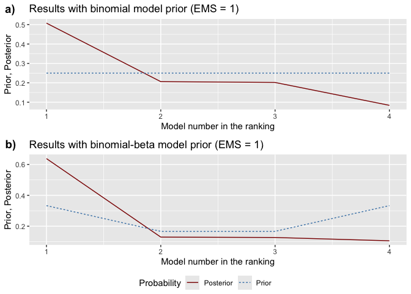
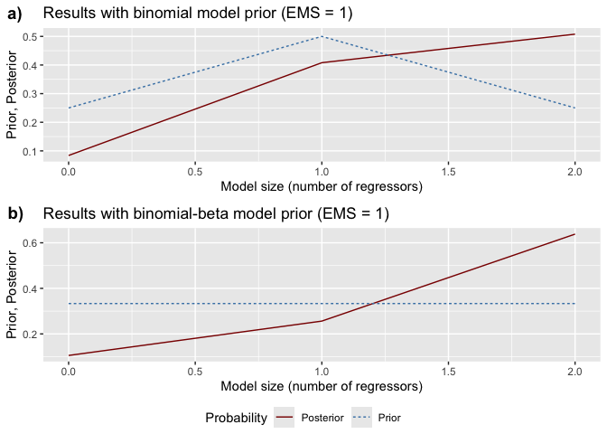
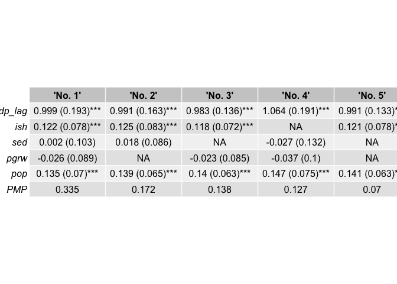
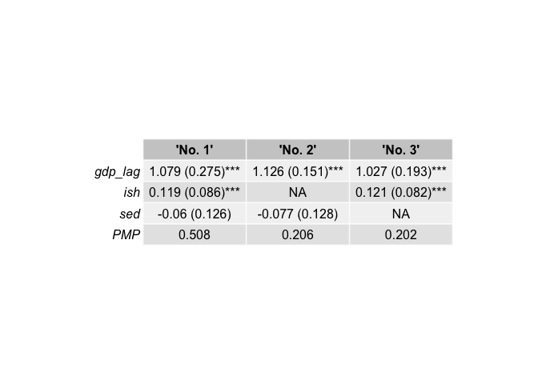

bdsm: Bayesian Dynamic Systems Modeling
================

<!-- README.md is generated from README.Rmd. Please edit that file -->

# bdsm: Bayesian Dynamic Systems Modeling

[](https://CRAN.R-project.org/package=bdsm)
[-blue.svg)](https://www.gnu.org/licenses/gpl-2.0.html)
[](https://github.com/mateuszwyszynski/bdsm/actions/workflows/R-CMD-check-main.yaml)

## Overview

The **bdsm** package implements Bayesian model averaging (BMA) for
dynamic panels with weakly exogenous regressors, following the
methodology of [Moral-Benito (2016)](#references). This addresses both:

1.  **Model uncertainty** (selecting among many candidate regressors),
2.  **Reverse causality** (weak exogeneity, which permits current values
    of regressors to correlate with past shocks and other regressors).

The package features:

- Tools to **estimate** the entire model space (via maximum likelihood)
  and calculate **Bayesian information criterion (BIC)** for each
  variant.
- Flexible **model priors** (binomial, binomial-beta, optional dilution
  prior).
- Comprehensive **BMA statistics**, including posterior inclusion
  probabilities (PIPs), posterior means, and posterior standard
  deviations (regular or robust).
- Functions to **visualize** prior and posterior model probabilities.
- **Jointness measures** for pairs of regressors, indicating whether
  they are complements or substitutes.
- Support for **parallel computing** to handle large model spaces.

## Installation

You can install the released version of bdsm from
[CRAN](https://CRAN.R-project.org) with:

``` r
install.packages("bdsm")
```

And the development version from [GitHub](https://github.com/) with:

``` r
# install.packages("devtools")
devtools::install_github("mateuszwyszynski/bdsm")
```

Once installed, simply load the package:

``` r
library(bdsm)
```

## Getting Started

### Data Preparation

Your data should be in the following format:

1.  A **time** column (e.g., `year`),
2.  An **entity** column (e.g., `country`),
3.  A **dependent variable** column (the variable of interest,
    e.g. `gdp`),
4.  Remaining columns as potential **regressors**.

A convenience function `join_lagged_col()` can help transform a dataset
that already contains both a variable and its lagged version into the
required format.

You can also use `feature_standardization()` to perform mean-centering,
demeaning (entity/time effects), or scaling (standardization) as needed.
For example:

``` r
library(magrittr)

set.seed(20)

# Features are scaled and demeaned,
# then centralized around the mean within cross-sections (fixed time effects)
data_prepared <- bdsm::economic_growth[, 1:5] %>%
  bdsm::feature_standardization(
    excluded_cols = c(country, year, gdp)
  ) %>%
  bdsm::feature_standardization(
    group_by_col  = year,
    excluded_cols = country,
    scale         = FALSE
  )
```

### Estimating the Model Space

The function `optim_model_space()` estimates all possible models (each
possible subset of regressors) via maximum likelihood, storing the
results in a list object. For small to moderately sized datasets:

``` r
model_space <- bdsm::optim_model_space(
  df             = data_prepared,
  dep_var_col    = gdp,      # Dependent variable
  timestamp_col  = year,
  entity_col     = country,
  init_value     = 0.5,
)
```

For larger datasets, you can leverage multiple cores:

``` r
library(parallel)

# Choose an appropriate number of cores, taking into account system-level limits
cores <- as.integer(Sys.getenv("_R_CHECK_LIMIT_CORES_", unset = NA))
if (is.na(cores)) {
  cores <- detectCores()
} else {
  cores <- min(cores, detectCores())
}
cl <- makeCluster(cores)

model_space <- bdsm::optim_model_space(
  df             = data_prepared,
  timestamp_col  = year,
  entity_col     = country,
  dep_var_col    = gdp,
  init_value     = 0.5,
  cl             = cl
)

stopCluster(cl)
```

A progress bar is displayed to easily track the ongoing computation.

### Performing Bayesian Model Averaging

After preparing the model space, run `bma()` to obtain posterior model
probabilities, posterior inclusion probabilities (PIPs), and other BMA
statistics under the **binomial** and **binomial-beta** model priors:

``` r
bma_results <- bdsm::bma(model_space, df = data_prepared, round = 3)

# Inspect the BMA summary (binomial prior results first, binomial-beta second)
bma_results[[1]]  # BMA stats under binomial prior
#>           PIP     PM   PSD  PSDR  PMcon PSDcon PSDRcon %(+)
#> gdp_lag    NA  1.078 0.110 0.229  1.078  0.110   0.229  100
#> ish     0.710  0.085 0.061 0.090  0.120  0.032   0.085  100
#> sed     0.714 -0.046 0.061 0.111 -0.065  0.064   0.127    0
bma_results[[2]]  # BMA stats under binomial-beta prior
#>           PIP     PM   PSD  PSDR  PMcon PSDcon PSDRcon %(+)
#> gdp_lag    NA  1.078 0.110 0.239  1.078  0.110   0.239  100
#> ish     0.765  0.091 0.058 0.090  0.120  0.033   0.085  100
#> sed     0.768 -0.048 0.062 0.114 -0.063  0.064   0.126    0

# Posterior model sizes:
bma_results[[16]]
#>               Prior models size Posterior model size
#> Binomial                      1                1.424
#> Binomial-beta                 1                1.533
```

Key columns in the BMA output include: - **PIP**: Posterior inclusion
probability for each regressor. - **PM**: Posterior mean of each
parameter (averaged over all models). - **PSD/PSDR**: Posterior standard
deviations (regular/robust) of each parameter - **%(+)**: Percentage of
models (among those that include a given regressor) in which the
parameter estimate is positive.

### Visualizing Prior and Posterior Probabilities

1.  **`model_pmp()`**: Shows prior vs. posterior model probabilities,
    ranking models from best to worst.
2.  **`model_sizes()`**: Displays how prior vs. posterior probabilities
    mass is distributed across different model sizes.

``` r
# Plot prior vs. posterior model probabilities
pmp_graphs <- bdsm::model_pmp(bma_results, top = 3)  # Show top 3 models
```



``` r

# Plot probabilities by model size
size_graphs <- bdsm::model_sizes(bma_results)
```



### Selecting the Best Models

Use `best_models()` to extract specific information about the top-ranked
models:

``` r
# Retrieve the 5 best models according to binomial prior
top3_binom <- bdsm::best_models(bma_results, criterion = 1, best = 3)
```



``` r

# Print the inclusion matrix for each of the top 3 models
top3_binom[[1]]
#>         'No. 1' 'No. 2' 'No. 3'
#> gdp_lag   1.000   1.000   1.000
#> ish       1.000   0.000   1.000
#> sed       1.000   1.000   0.000
#> PMP       0.508   0.206   0.202

# Retrieve robust standard errors in a knit-friendly table
top3_binom[[6]]
```

|         |       ‘No. 1’       |       ‘No. 2’       |       ‘No. 3’       |
|:--------|:-------------------:|:-------------------:|:-------------------:|
| gdp_lag | 1.079 (0.275)\*\*\* | 1.126 (0.151)\*\*\* | 1.027 (0.193)\*\*\* |
| ish     | 0.119 (0.086)\*\*\* |         NA          | 0.121 (0.082)\*\*\* |
| sed     |    -0.06 (0.126)    |   -0.077 (0.128)    |         NA          |
| PMP     |        0.508        |        0.206        |        0.202        |

### Jointness Measures

Assess whether two regressors tend to co-occur (complements) or exclude
each other (substitutes) using `jointness()`. By default, it calculates
the Hofmarcher et al. (2018) measure:

``` r
joint_measures <- bdsm::jointness(bma_results)
head(joint_measures)
#>       ish   sed
#> ish    NA 0.159
#> sed 0.505    NA
```

You can also specify older measures, such as `"LS"` (Ley & Steel) or
`"DW"` (Doppelhofer & Weeks):

``` r
joint_measures_ls <- bdsm::jointness(bma_results, measure = "LS")
```

## Example

Below is a minimal reproducible workflow:

``` r
# 1) Data preparation
data_prepared <- bdsm::economic_growth[, 1:5] %>%
  bdsm::feature_standardization(
    excluded_cols = c(country, year, gdp)
  ) %>%
  bdsm::feature_standardization(
    group_by_col  = year,
    excluded_cols = country,
    scale         = FALSE
  )

# 2) Estimate model space
model_space <- bdsm::optim_model_space(
  df            = data_prepared,
  dep_var_col   = gdp,
  timestamp_col = year,
  entity_col    = country,
  init_value     = 0.5,
)

# 3) Run Bayesian Model Averaging
bma_obj <- bdsm::bma(
  model_space = model_space,
  df          = data_prepared
)

# 4) Inspect the top 3 models under binomial prior
best_3 <- bdsm::best_models(
  bma_list = bma_obj,
  criterion = 1,
  best = 3
)
```



``` r
best_3[[1]]  # Inclusion table
#>         'No. 1' 'No. 2' 'No. 3'
#> gdp_lag   1.000   1.000   1.000
#> ish       1.000   0.000   1.000
#> sed       1.000   1.000   0.000
#> PMP       0.508   0.206   0.202
best_3[[2]]  # Coefficients & standard errors
#>         'No. 1'            'No. 2'            'No. 3'           
#> gdp_lag "1.079 (0.111)***" "1.126 (0.106)***" "1.027 (0.093)***"
#> ish     "0.119 (0.033)***" NA                 "0.121 (0.03)***" 
#> sed     "-0.06 (0.063)"    "-0.077 (0.063)"   NA                
#> PMP     "0.508"            "0.206"            "0.202"
```

## Troubleshooting

1.  Cannot install required packages / setup renv environment

Make sure to go through the displayed errors. The problem might be
connected to your OS environment. E.g. you might see an information like
the following:

    Configuration failed to find one of freetype2 libpng libtiff-4 libjpeg. Try installing:
     * deb: libfreetype6-dev libpng-dev libtiff5-dev libjpeg-dev (Debian, Ubuntu, etc)
     * rpm: freetype-devel libpng-devel libtiff-devel libjpeg-devel (Fedora, CentOS, RHEL)
     * csw: libfreetype_dev libpng16_dev libtiff_dev libjpeg_dev (Solaris)

In such case you should first try installing the recommended packages.
With properly configured system environment everything should work fine.

## References

<div id="references">

</div>

- Moral-Benito, E. (2016). “Model Averaging in Economics: An Overview.”
  *Journal of Economic Surveys*.
- Ley, E. and Steel, M. F. J. (2007). “Jointness in Bayesian Variable
  Selection with Applications to Growth Regression.” *Journal of
  Macroeconomics*.
- Doppelhofer, G. and Weeks, M. (2009). “Jointness of Growth
  Determinants.” *Journal of Applied Econometrics*.
- Hofmarcher, P., Crespo Cuaresma, J., Huber, F., and Moser, M. (2018).
  “Forecasting with Bayesian Model Averaging: New Classical and Bayesian
  Perspectives.” *Journal of Applied Econometrics*.

(Additional references related to the methodology can be found in the
package vignette.)

## Contributions and Issues

We welcome bug reports, feature requests, and contributions. Feel free
to open an issue or pull request on
[GitHub](https://github.com/mateuszwyszynski/bdsm).

## License

This package is distributed under the GPL ($\geq 2$) license. See the
[LICENSE](LICENSE) file for details.

------------------------------------------------------------------------
