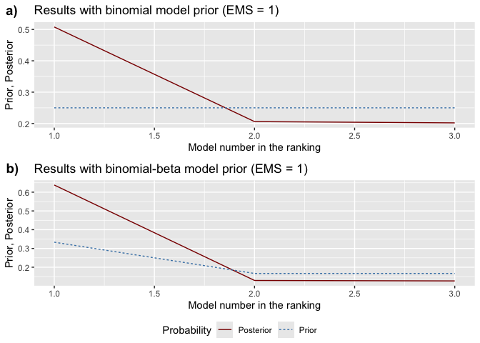

bdsm: Bayesian Dynamic Systems Modeling
================

<!-- README.md is generated from README.Rmd. Please edit that file -->

# bdsm: Bayesian Dynamic Systems Modeling

[](https://CRAN.R-project.org/package=bdsm)
[-blue.svg)](https://www.gnu.org/licenses/gpl-2.0.html)
[](https://github.com/mateuszwyszynski/bdsm/actions)

## Overview

The **bdsm** package implements Bayesian model averaging (BMA) for
dynamic panels with weakly exogenous regressors, following the
methodology of [Moral-Benito (2016)](#references). This addresses both:

1.  **Model uncertainty** (selecting among many candidate regressors),
2.  **Reverse causality** (weak exogeneity, which permits current values
    of regressors to correlate with past shocks and other regressors).

The package features:

- Tools to **estimate** the entire model space (via maximum likelihood)
  and calculate **Bayesian information criterion (BIC)** for each
  variant.
- Flexible **model priors** (binomial, binomial-beta, optional dilution
  prior).
- Comprehensive **BMA statistics**, including posterior inclusion
  probabilities (PIPs), posterior means, and posterior standard
  deviations (regular or robust).
- Functions to **visualize** prior and posterior model probabilities.
- **Jointness measures** for pairs of regressors, indicating whether
  they are complements or substitutes.
- Support for **parallel computing** to handle large model spaces.

## Installation

You can install the released version of bdsm from
[CRAN](https://CRAN.R-project.org) with:

``` r
install.packages("bdsm")
```

And the development version from [GitHub](https://github.com/) with:

``` r
# install.packages("devtools")
devtools::install_github("mateuszwyszynski/bdsm")
```

Once installed, simply load the package:

``` r
library(bdsm)
```

## Getting Started

### Data Preparation

Your data should be in the following format: 1. A **time** column (e.g.,
`year`), 2. An **entity** column (e.g., `country`), 3. A **dependent
variable** column (the variable of interest, e.g. `gdp`), 4. Remaining
columns as potential **regressors**.

A convenience function `join_lagged_col()` can help transform a dataset
that already contains both a variable and its lagged version into the
required format. You can also use `data_prep()` to perform
mean-centering, demeaning (entity/time effects), or scaling
(standardization) as needed. For example:

``` r
library(magrittr)

set.seed(20)

# Features are scaled and centralized around the mean.
# Then they are centralized around the mean within cross-sections (fixed time effects)
data_prepared <- bdsm::economic_growth[,1:7] %>%
  bdsm::feature_standardization(timestamp_col = year, entity_col = gdp) %>%
  bdsm::feature_standardization(timestamp_col = year, entity_col = country,
                          time_effects = TRUE, scale = FALSE)
```

### Estimating the Model Space

The function `bma_prep()` estimates all possible models (each possible
subset of regressors) via maximum likelihood, storing the results in a
list object. For small to moderately sized datasets:

``` r
for_bma <- bdsm::bma_prep(
  df             = data_prepared,
  dep_var_col    = gdp,      # Dependent variable
  timestamp_col  = year,
  entity_col     = country,
  init_value     = 0.5,
)
#> initial  value 700.805202 
#> iter 100 value 63.489964
#> final  value 62.413224 
#> converged
#> initial  value 755.227924 
#> iter 100 value -7.081746
#> final  value -9.945489 
#> converged
#> initial  value 731.149545 
#> iter 100 value -5.728710
#> final  value -7.336652 
#> converged
#> initial  value 865.987070 
#> iter 100 value -75.528524
#> final  value -81.347491 
#> converged
#> initial  value 821.652572 
#> iter 100 value 12.593978
#> final  value 9.478839 
#> converged
#> initial  value 788.836005 
#> iter 100 value -61.377699
#> final  value -62.826938 
#> converged
#> initial  value 747.497621 
#> iter 100 value -56.890341
#> final  value -58.756416 
#> converged
#> initial  value 792.979857 
#> iter 100 value -127.201548
#> final  value -132.333776 
#> converged
#> initial  value 665.161630 
#> iter 100 value -242.698752
#> final  value -256.663454 
#> converged
#> initial  value 708.042561 
#> iter 100 value -326.609584
#> final  value -328.729156 
#> converged
#> initial  value 678.350819 
#> iter 100 value -315.110317
#> final  value -323.599046 
#> converged
#> initial  value 802.194508 
#> iter 100 value -392.089550
#> final  value -397.592119 
#> converged
#> initial  value 750.297273 
#> iter 100 value -296.583891
#> final  value -309.577948 
#> converged
#> initial  value 709.806113 
#> iter 100 value -375.455174
#> final  value -381.498968 
#> converged
#> initial  value 661.102743 
#> iter 100 value -365.114246
#> final  value -375.096037 
#> converged
#> initial  value 701.509591 
#> iter 100 value -436.936673
#> final  value -448.914323 
#> converged
```

For larger datasets, you can leverage multiple cores:

``` r
library(parallel)
cl <- safeMakeCluster()
setDefaultCluster(cl)

for_bma <- bdsm::bma_prep(
  df             = data_prepared,
  timestamp_col  = year,
  entity_col     = country,
  dep_var_col    = gdp,
  init_value     = 0.5,
  run_parallel   = TRUE,
)

stopCluster(cl = NULL)
```

### Performing Bayesian Model Averaging

After preparing the model space, run `bma()` to obtain posterior model
probabilities, posterior inclusion probabilities (PIPs), and other BMA
statistics under the **binomial** and **binomial-beta** model priors:

``` r
bma_results <- bdsm::bma(for_bma, df = data_prepared, round = 3)

# Inspect the BMA summary (binomial prior results first, binomial-beta second)
bma_results[[1]]  # BMA stats under binomial prior
#>           PIP     PM   PSD  PSDR  PMcon PSDcon PSDRcon  %(+)
#> gdp_lag    NA  1.008 0.111 0.167  1.008  0.111   0.167 100.0
#> ish     0.724  0.088 0.061 0.086  0.122  0.032   0.078 100.0
#> sed     0.708  0.000 0.055 0.090 -0.001  0.065   0.107  37.5
#> pgrw    0.662 -0.018 0.035 0.075 -0.028  0.040   0.091   0.0
#> pop     0.987  0.140 0.054 0.070  0.142  0.051   0.068 100.0
bma_results[[2]]  # BMA stats under binomial-beta prior
#>           PIP     PM   PSD  PSDR  PMcon PSDcon PSDRcon  %(+)
#> gdp_lag    NA  1.003 0.111 0.182  1.003  0.111   0.182 100.0
#> ish     0.878  0.107 0.050 0.083  0.122  0.032   0.078 100.0
#> sed     0.870  0.001 0.059 0.098  0.001  0.064   0.105  37.5
#> pgrw    0.849 -0.023 0.038 0.083 -0.027  0.039   0.090   0.0
#> pop     0.994  0.137 0.052 0.070  0.138  0.051   0.069 100.0

# Posterior model sizes:
bma_results[[16]]
#>               Prior models size Posterior model size
#> Binomial                      2                 3.08
#> Binomial-beta                 2                 3.59
```

Key columns in the BMA output include: - **PIP**: Posterior inclusion
probability for each regressor. - **PM**: Posterior mean of each
parameter (averaged over all models). - **PSD/PSDR**: Posterior standard
deviations (regular/robust) of each parameter. - **%(+)**: Percentage of
models (among those that include a given regressor) in which the
parameter estimate is positive.

### Visualizing Prior and Posterior Probabilities

1.  **`model_pmp()`**: Shows prior vs. posterior model probabilities,
    ranking models from best to worst.
2.  **`model_sizes()`**: Displays how prior vs. posterior probabilities
    mass is distributed across different model sizes.

``` r
# Plot prior vs. posterior model probabilities
pmp_graphs <- bdsm::model_pmp(bma_results, top = 10)  # Show top 10 models
```



``` r

# Plot probabilities by model size
size_graphs <- bdsm::model_sizes(bma_results)
```


### Selecting the Best Models

Use `best_models()` to extract specific information about the top-ranked
models:

``` r
# Retrieve the 5 best models according to binomial prior
top5_binom <- bdsm::best_models(bma_results, criterion = 1, best = 5)
```


``` r

# Print the inclusion matrix for each of the top 5 models
top5_binom[[1]]
#>         'No. 1' 'No. 2' 'No. 3' 'No. 4' 'No. 5'
#> gdp_lag   1.000   1.000   1.000   1.000    1.00
#> ish       1.000   1.000   1.000   0.000    1.00
#> sed       1.000   1.000   0.000   1.000    0.00
#> pgrw      1.000   0.000   1.000   1.000    0.00
#> pop       1.000   1.000   1.000   1.000    1.00
#> PMP       0.335   0.172   0.138   0.127    0.07

# Retrieve robust standard errors in a knit-friendly table
top5_binom[[6]]
```

|  | ‘No. 1’ | ‘No. 2’ | ‘No. 3’ | ‘No. 4’ | ‘No. 5’ |
|:---|:--:|:--:|:--:|:--:|:--:|
| gdp_lag | 0.999 (0.193)\*\*\* | 0.991 (0.163)\*\*\* | 0.983 (0.136)\*\*\* | 1.064 (0.191)\*\*\* | 0.991 (0.133)\*\*\* |
| ish | 0.122 (0.078)\*\*\* | 0.125 (0.083)\*\*\* | 0.118 (0.072)\*\*\* | NA | 0.121 (0.078)\*\*\* |
| sed | 0.002 (0.103) | 0.018 (0.086) | NA | -0.027 (0.132) | NA |
| pgrw | -0.026 (0.089) | NA | -0.023 (0.085) | -0.037 (0.1) | NA |
| pop | 0.135 (0.07)\*\*\* | 0.139 (0.065)\*\*\* | 0.14 (0.063)\*\*\* | 0.147 (0.075)\*\*\* | 0.141 (0.063)\*\*\* |
| PMP | 0.335 | 0.172 | 0.138 | 0.127 | 0.07 |

### Jointness Measures

Assess whether two regressors tend to co-occur (complements) or exclude
each other (substitutes) using `jointness()`. By default, it calculates
the Hofmarcher et al. (2018) measure:

``` r
joint_measures <- bdsm::jointness(bma_results)
head(joint_measures)
#>        ish   sed  pgrw   pop
#> ish     NA 0.165 0.122 0.432
#> sed  0.622    NA 0.109 0.400
#> pgrw 0.595 0.586    NA 0.311
#> pop  0.751 0.736 0.694    NA
```

You can also specify older measures, such as `"LS"` (Ley & Steel) or
`"DW"` (Doppelhofer & Weeks):

``` r
joint_measures_ls <- bdsm::jointness(bma_results, measure = "LS")
```

## Example

Below is a minimal reproducible workflow:

``` r
# 1) Load data
data("economic_growth")

# 2) Data preparation
df_prepared <- bdsm::data_prep(
  df           = economic_growth[, 1:7],
  timestamp_col= year,
  entity_col   = country,
  standardize  = TRUE,
  time_effects = TRUE,
)

# 3) Estimate model space
prep_obj <- bdsm::bma_prep(
  df            = df_prepared,
  dep_var_col   = gdp,
  timestamp_col = year,
  entity_col    = country,
  init_value     = 0.5,
)
#> initial  value 761.409660 
#> iter 100 value 154.656759
#> final  value 152.285429 
#> converged
#> initial  value 823.376496 
#> iter 100 value 80.620901
#> final  value 80.447574 
#> converged
#> initial  value 816.762989 
#> iter 100 value 83.532974
#> final  value 82.996391 
#> converged
#> initial  value 954.565299 
#> iter 100 value 10.079009
#> final  value 9.348864 
#> converged
#> initial  value 891.143160 
#> iter 100 value 101.554618
#> final  value 99.086252 
#> converged
#> initial  value 870.107560 
#> iter 100 value 30.847639
#> final  value 27.494908 
#> converged
#> initial  value 819.683263 
#> iter 100 value 36.050800
#> final  value 31.737122 
#> converged
#> initial  value 871.895260 
#> iter 100 value -37.741121
#> final  value -41.751364 
#> converged
#> initial  value 726.686680 
#> iter 100 value -154.417768
#> final  value -159.696075 
#> converged
#> initial  value 776.294614 
#> iter 100 value -231.091174
#> final  value -231.603381 
#> converged
#> initial  value 774.228575 
#> iter 100 value -223.736674
#> final  value -227.319915 
#> converged
#> initial  value 900.489240 
#> iter 100 value -300.295339
#> final  value -301.912773 
#> converged
#> initial  value 816.359982 
#> iter 100 value -198.313755
#> final  value -212.309609 
#> converged
#> initial  value 786.328207 
#> iter 100 value -270.942526
#> final  value -283.989694 
#> converged
#> initial  value 739.460346 
#> iter 100 value -269.282240
#> final  value -278.805113 
#> converged
#> initial  value 785.477621 
#> iter 100 value -336.032998
#> final  value -353.170418 
#> converged

# 4) Run Bayesian Model Averaging
bma_obj <- bdsm::bma(prep_obj, df = df_prepared)

# 5) Inspect the top 3 models under binomial prior
best_3 <- bdsm::best_models(bma_obj, criterion = 1, best = 3)
```


``` r
best_3[[1]]  # Inclusion table
#>         'No. 1' 'No. 2' 'No. 3'
#> gdp_lag   1.000   1.000   1.000
#> ish       1.000   1.000   1.000
#> sed       1.000   1.000   0.000
#> pgrw      1.000   0.000   1.000
#> pop       1.000   1.000   1.000
#> PMP       0.337   0.173   0.136
best_3[[2]]  # Coefficients & standard errors
#>         'No. 1'            'No. 2'            'No. 3'           
#> gdp_lag "0.742 (0.059)***" "0.745 (0.06)***"  "0.816 (0.043)***"
#> ish     "0.096 (0.025)***" "0.1 (0.025)***"   "0.09 (0.026)***" 
#> sed     "0.071 (0.04)*"    "0.062 (0.038)"    NA                
#> pgrw    "0.024 (0.035)"    NA                 "0.007 (0.034)"   
#> pop     "0.181 (0.043)***" "0.174 (0.042)***" "0.17 (0.043)***" 
#> PMP     "0.337"            "0.173"            "0.136"
```

## Troubleshooting

1.  Cannot install required packages / setup renv environment

Make sure to go through the displayed errors. The problem might be
connected to your OS environment. E.g. you might see an information like
the following:

    Configuration failed to find one of freetype2 libpng libtiff-4 libjpeg. Try installing:
     * deb: libfreetype6-dev libpng-dev libtiff5-dev libjpeg-dev (Debian, Ubuntu, etc)
     * rpm: freetype-devel libpng-devel libtiff-devel libjpeg-devel (Fedora, CentOS, RHEL)
     * csw: libfreetype_dev libpng16_dev libtiff_dev libjpeg_dev (Solaris)

In such case you should first try installing the recommended packages.
With properly configured system environment everything should work fine.

## References

<div id="references">

</div>

- Moral-Benito, E. (2016). “Model Averaging in Economics: An Overview.”
  *Journal of Economic Surveys*.
- Ley, E. and Steel, M. F. J. (2007). “Jointness in Bayesian Variable
  Selection with Applications to Growth Regression.” *Journal of
  Macroeconomics*.
- Doppelhofer, G. and Weeks, M. (2009). “Jointness of Growth
  Determinants.” *Journal of Applied Econometrics*.
- Hofmarcher, P., Crespo Cuaresma, J., Huber, F., and Moser, M. (2018).
  “Forecasting with Bayesian Model Averaging: New Classical and Bayesian
  Perspectives.” *Journal of Applied Econometrics*.

(Additional references related to the methodology can be found in the
package vignette.)

## Contributions and Issues

We welcome bug reports, feature requests, and contributions. Feel free
to open an issue or pull request on
[GitHub](https://github.com/mateuszwyszynski/bdsm).

## License

This package is distributed under the GPL ($\geq 2$) license. See the
[LICENSE](LICENSE) file for details.

------------------------------------------------------------------------
